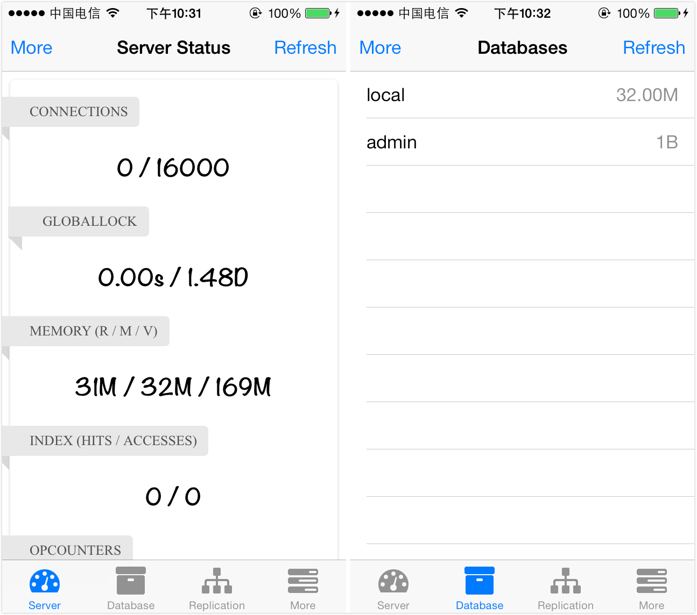
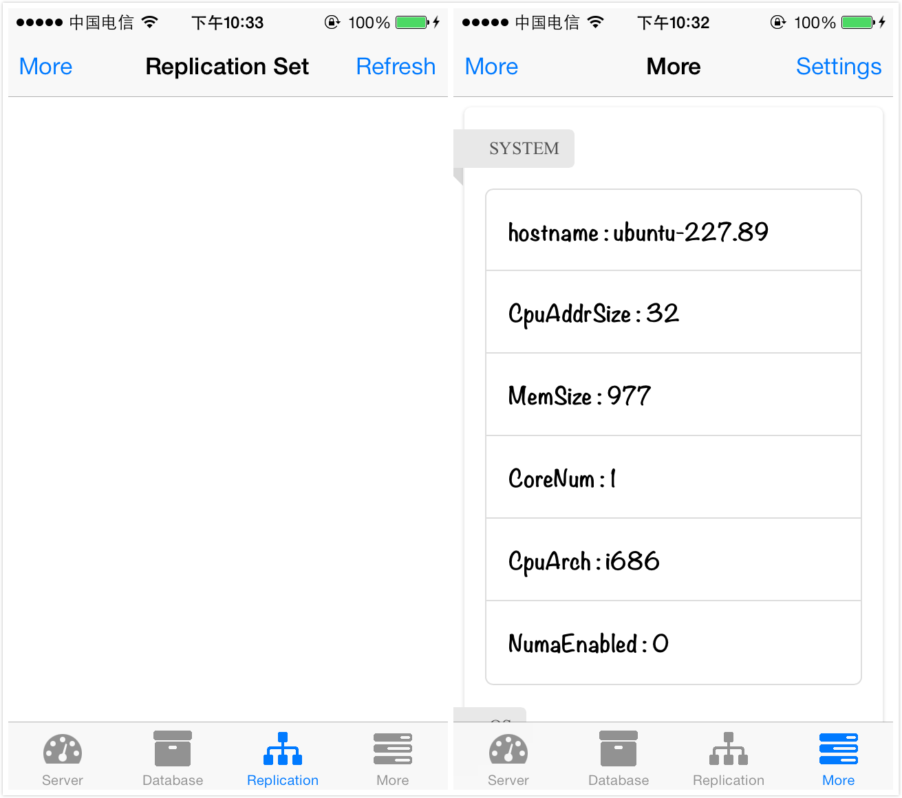

MongoMonitor
==========

A iOS App that views MongoDB serverStatus via its REST API. My First iOS App : ).

## Screenshots

## More

For more details, please visit [my blog](http://liushuaikobe.github.io/blog/2013/12/01/ios-developer-for-a-week/).
